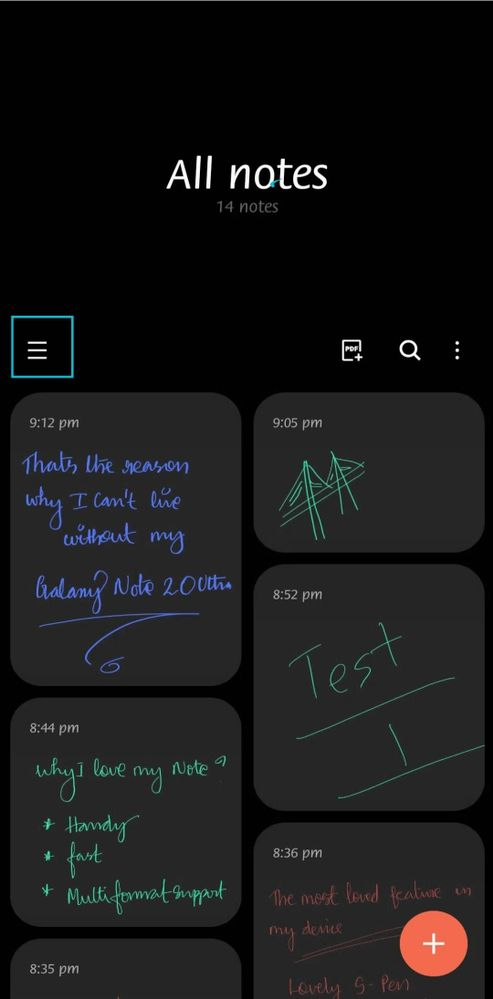

# Overview

This project is a model of a distributed system which models a notebook of a user. The notebook is a set of **notes** that will be maintained by the user, and that can only be accessed by the user itself.

We have two types of entities, the `user` and the `admin`. Each one has a `client` and a `server` application, that communicate to each other in order to maintain the shared database (everything must talk to each other remotely using the network). The database will contain the information about the users and about their notes.

The applications to be developed are:
- `AdminApp`: client application for the admins
- `UserApp`: client application for the users
- `AdminPortal`: server application for the admins
- `UserPortal`: server application for the users

For the communication between `AdminApp` and `AdminPortal` we use `gRPC`, while for the `UserApp` and `UserPortal` we use `sockets` directly.

## About the application

The goal of the application is to be a way for the users to keep their notes in an unique place, and to be able to access them from wherever they are.

Think about it as a kind of **cloud**-based `samsung notes` app. Where the user can keep their notes, but instead of keeping them on the user's phone, we keep them on the cloud.

# Dependencies

To build the project we've chosen to use the Google's compiler `Bazel`. All the dependencies needed are listed below:

1. install [bazel](https://docs.bazel.build/versions/main/install.html)
2. install Java JDK (you can skip this if you already have some Java JDK installed in your machine).

# Execution

Execute the server and the client on different terminals to see they exchanging messages.

## Servers
On folder `src/main/java/com/server` run:
- `bazel run user:portal` to start the `UserPortal` application.
- `bazel run admin:portal` to start the `AdminPortal` application.

## Client
On folder `src/main/java/com/client` run:
- `bazel run user:app` to start the `UserApp` application.
- `bazel run admin:app` to start the `AdminApp` application.

The applications on client side (`UserApp` and `AdminApp`) should print on the screen the message received from the respective server.
